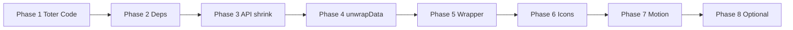

# Ponytail-Audit — Umsetzungsplan

**Projekt:** nuernbergspots-admin-fe  
**Erstellt:** 2026-06-22  
**Status:** in-progress  
**Quelle:** Repo-weiter Ponytail-Audit (Over-Engineering, keine Korrektur-/Security-Fixes)  
**Regel:** Phasen **nacheinander** abarbeiten; nächste Phase erst nach grüner Verifikation der aktuellen

## Verifikation (jede Phase)

Nach jeder Phase müssen alle drei Schritte erfolgreich sein:

```bash
npm run test
npm run build
npm run start:dev
```

Optional zusätzlich (empfohlen vor Merge):

```bash
npm run validate   # type-check + lint + format:check + test
```

`start:dev` kurz manuell prüfen (Login-Seite lädt, Navigation startet). Bei reinen DevDep-/Config-Änderungen reicht ein kurzer Smoke-Check.

---

## Übersicht

| Phase | Titel                         | Cursor-Plan                                                                  | Risiko      | Status        |
| ----- | ----------------------------- | ---------------------------------------------------------------------------- | ----------- | ------------- |
| 1     | Toter Code & Artefakte        | [ponytail_phase1_dead_code.plan.md](./ponytail_phase1_dead_code.plan.md)     | Niedrig     | `done`        |
| 2     | Ungenutzte Dependencies       | [ponytail_phase2_unused_deps.plan.md](./ponytail_phase2_unused_deps.plan.md) | Niedrig     | `done`        |
| 3     | API-Client & Fehler-Utils     | [ponytail_phase3_api_errors.plan.md](./ponytail_phase3_api_errors.plan.md)   | Niedrig     | `done`        |
| 4     | API-Response-Layer            | [ponytail_phase4_unwrap_data.plan.md](./ponytail_phase4_unwrap_data.plan.md) | Mittel      | `done`        |
| 5     | Button- & Layout-Wrapper      | [ponytail_phase5_wrappers.plan.md](./ponytail_phase5_wrappers.plan.md)       | Mittel      | `done`        |
| 6     | Icon-Stack (MUI raus)         | [ponytail_phase6_icons.plan.md](./ponytail_phase6_icons.plan.md)             | Mittel–Hoch | `done`        |
| 7     | framer-motion → CSS           | [ponytail_phase7_motion_css.plan.md](./ponytail_phase7_motion_css.plan.md)   | Hoch        | `done`        |
| 8     | Optional (Presets & Services) | [ponytail_phase8_optional.plan.md](./ponytail_phase8_optional.plan.md)       | Mittel      | `in-progress` |

**Status-Werte:** `open` | `in-progress` | `done` | `blocked` | `skipped`

---

## Phase 1 — Toter Code & Build-Artefakte

**Ziel:** Alles entfernen, was die App nicht nutzt und kein Verhalten ändert.

### Umfang

| Aktion      | Dateien / Bereich                                                                                         |
| ----------- | --------------------------------------------------------------------------------------------------------- |
| Löschen     | `src/modules/partner/` (Duplikat-Services, 0 Imports)                                                     |
| Löschen     | `src/components/CustomerScansAnalysis.tsx` + `src/components/__tests__/CustomerScansAnalysis.test.tsx`    |
| Löschen     | `src/components/ui/command.tsx` + `src/components/ui/__tests__/command.test.tsx`                          |
| Löschen     | Ungenutzte Exports in `src/lib/animations.ts`: `slideInLeft`, `pulse`, `expandCollapse`, `slowTransition` |
| Löschen     | Stub-Typen `Business` / `City` in `src/lib/api.ts`                                                        |
| Löschen     | `createContextualError` in `src/utils/errorUtils.ts` (keine Caller)                                       |
| Entfernen   | Doppelter `material-icons`-CSS-Import in `src/pages/categories/CategoryList.tsx` (bereits in `index.css`) |
| Git-Hygiene | `public/assets/` aus dem Repo entfernen, in `.gitignore` aufnehmen                                        |

### Schritte

- [ ] `public/assets/` aus Git tracken entfernen (`git rm -r public/assets/`)
- [ ] `.gitignore` um `public/assets/` ergänzen (ggf. Kommentar: nur `dist/` deployen)
- [ ] Prüfen, ob Firebase-Hosting `dist/` nutzt (nicht `public/assets/`) — `.firebase/hosting.*` / `firebase.json`
- [ ] Tote Module/Dateien löschen (siehe Tabelle)
- [ ] Imports und Jest-Mocks bereinigen, die auf gelöschte Dateien verweisen
- [ ] `npm uninstall cmdk` (nach Löschen von `command.tsx`)

### Verifikation

```bash
npm run test && npm run build && npm run start:dev
```

### Erfolgskriterien

- Keine Import-Fehler / keine toten Test-Referenzen
- Build erzeugt frisches `dist/`, kein Bedarf an committed `public/assets/`
- App startet und rendert Login/Dashboard

---

## Phase 2 — Ungenutzte Dependencies

**Ziel:** Packages entfernen, die im Quellcode nicht referenziert werden.

### Umfang

| Package                        | Grund                                                           |
| ------------------------------ | --------------------------------------------------------------- |
| `date-fns-tz`                  | Kein Import im `src/`                                           |
| `@tailwindcss/postcss7-compat` | Vite nutzt `@tailwindcss/vite`; Legacy-PostCSS-Pipeline obsolet |

### Schritte

- [ ] `npm uninstall date-fns-tz`
- [ ] `postcss.config.cjs` prüfen: `@tailwindcss/postcss7-compat` entfernen
- [ ] Falls PostCSS nur für Tailwind v4-Compat da war: `postcss.config.cjs` ganz entfernen oder auf `postcss-nesting` + `autoprefixer` reduzieren (nur wenn Build ohne compat läuft)
- [ ] `npm uninstall @tailwindcss/postcss7-compat`
- [ ] `npm run build` — sicherstellen, dass Tailwind/Styles unverändert kompilieren

### Verifikation

```bash
npm run test && npm run build && npm run start:dev
```

### Erfolgskriterien

- `package.json` / Lockfile ohne die beiden Packages
- Visuell unverändertes Styling auf Login + einer Listen-Seite

---

## Phase 3 — API-Client & Fehler-Utils straffen

**Ziel:** Duplikation in HTTP- und Fehlerbehandlung reduzieren, ohne API-Verhalten zu ändern.

### Umfang

**`src/lib/api-client.ts`**

- Eine private Methode `request<T>(method, endpoint, options?)` einführen
- `get` / `post` / `put` / `patch` / `delete` delegieren dorthin
- Gemeinsames `try/catch` für Netzwerkfehler nur einmal

**`src/utils/errorUtils.ts`**

- Doppelte Blöcke für 401 / 403 / 404 entfernen (z. B. Zeilen ~391–437 vs. ~521–567)
- Bestehende Tests in `src/utils/__tests__/errorUtils.test.ts` grün halten

**Optional (klein):**

- `src/utils/colorUtils.ts`: zwei Einzeiler an Call-Sites inline → Datei löschen, wenn nirgends mehr importiert

### Schritte

- [ ] `api-client.ts` refactoren, bestehende Service-Tests unverändert grün
- [ ] `errorUtils.ts` deduplizieren, Tests anpassen nur wenn nötig
- [ ] Optional: `colorUtils` inline + Datei löschen
- [ ] Keine Änderung an öffentlichen Service-Signaturen

### Verifikation

```bash
npm run test && npm run build && npm run start:dev
```

### Erfolgskriterien

- Alle Service- und `errorUtils`-Tests grün
- Manuell: ein Fehlerfall (z. B. Netzwerk/401) zeigt weiterhin Toast mit deutscher Meldung

---

## Phase 4 — API-Response-Layer vereinfachen

**Ziel:** `unwrapData(response)`-Boilerplate in Services eliminieren.

### Umfang

- `ApiClient`: JSON-Responses mit `{ data: T }` automatisch entpacken **oder** dedizierte Methoden `getData<T>()`
- `src/lib/apiUtils.ts` entfernen, wenn leer
- Alle `src/services/*` + `LocationSearch.tsx` + betroffene Tests/Mocks anpassen

### Schritte

- [ ] Entscheidung: immer `response.data` im Client vs. explizite `getData`-Methoden (empfohlen: nur bei `{ data }`-Envelope entpacken, Rest unverändert)
- [ ] `ApiClient` erweitern
- [ ] Services schrittweise migrieren (ein Commit, alle Services)
- [ ] Jest-Mocks `jest.mock('../../lib/apiUtils')` entfernen
- [ ] `apiUtils.ts` löschen

### Verifikation

```bash
npm run test && npm run build && npm run start:dev
```

### Erfolgskriterien

- Kein Import von `@/lib/apiUtils` / `../lib/apiUtils` mehr
- Listen-Seiten (Events, Businesses, News) laden Daten wie zuvor

---

## Phase 5 — Button- & Layout-Wrapper konsolidieren

**Ziel:** Redundante Motion-Wrapper und wiederholtes `PageTransition`-Boilerplate reduzieren.

### Umfang

**LoadingButton + AnimatedButton**

- `AnimatedButton` in `LoadingButton` aufgehen (scale/tap bleibt, `isLoading` optional)
- Alle Imports von `AnimatedButton` auf `LoadingButton` umstellen
- `src/components/AnimatedButton.tsx` löschen

**PageTransition zentral**

- `PageTransition` einmal im Layout / Route-Outlet (`App.tsx` oder `routes.tsx`), nicht auf jeder Seite
- `motion.div`-Wrapper pro Seite nur behalten, wo echte Listen-Stagger-Logik nötig ist (Phase 7)

### Schritte

- [ ] `LoadingButton` um Tap/Hover-Verhalten von `AnimatedButton` erweitern
- [ ] Seiten migrieren (~40 Dateien mit `AnimatedButton`)
- [ ] `PageTransition` in zentrales Layout verschieben
- [ ] Doppelte `<PageTransition>`-Wrapper aus Einzelseiten entfernen
- [ ] `AnimatePresence` an Routen nur, wenn Exit-Animationen sichtbar bleiben sollen

### Verifikation

```bash
npm run test && npm run build && npm run start:dev
```

### Erfolgskriterien

- Buttons mit Loading-State funktionieren (Spinner, disabled)
- Seitenwechsel weiterhin ohne Layout-Sprung
- Kein Import von `AnimatedButton` mehr

---

## Phase 6 — Icon-Stack vereinheitlichen (MUI entfernen)

**Ziel:** Drei Icon-Systeme auf zwei reduzieren: **Lucide** (UI) + **Material Symbols/Icons** (Kategorie-Icons).

### Umfang

| Entfernen                                                                     | Ersetzen durch                                                        |
| ----------------------------------------------------------------------------- | --------------------------------------------------------------------- |
| `@mui/material`, `@mui/icons-material`, `@emotion/react`, `@emotion/styled`   | —                                                                     |
| `import * as Icons from '@mui/icons-material'` in `iconUtils` / `icon-picker` | `MaterialIcon` + statische Icon-Name-Liste oder Lucide-Mapping        |
| `getIconComponent` mit MUI-Komponenten                                        | Font-basiertes `MaterialIcon` (`src/components/ui/material-icon.tsx`) |

### Schritte

- [ ] Icon-Namen inventarisieren (welche `iconName`-Strings kommen vom Backend?)
- [ ] `src/utils/iconUtils.tsx` auf `MaterialIcon` umstellen (kein MUI-Import)
- [ ] `src/components/ui/icon-picker.tsx`: Virtualisierung behalten, Rendering über `MaterialIcon` oder kuratierte Lucide-Liste
- [ ] `@tanstack/react-virtual` nur behalten, wenn Icon-Liste groß genug bleibt
- [ ] `npm uninstall @mui/material @mui/icons-material @emotion/react @emotion/styled`
- [ ] Bundle-Größe vor/nach in Build-Log notieren

### Verifikation

```bash
npm run test && npm run build && npm run start:dev
```

### Erfolgskriterien

- Kategorie-Listen (JobCategories, EventCategoryList, CategoryList) zeigen Icons korrekt
- Icon-Picker in Kategorie-Formularen funktioniert
- Kein `@mui/` Import mehr im `src/`

---

## Phase 7 — Animationen: framer-motion → CSS

**Ziel:** `framer-motion` entfernen; dekoratives Motion durch `tailwindcss-animate` / CSS ersetzen.

### Umfang

| Entfernen / Ersetzen        | Anmerkung                                                                  |
| --------------------------- | -------------------------------------------------------------------------- |
| `framer-motion` Dependency  | Nach Migration aller Usages                                                |
| `src/lib/animations.ts`     | Durch Tailwind-Klassen (`animate-in`, `fade-in`, `slide-in-from-bottom-*`) |
| `motion.div` auf ~50 Seiten | Schrittweise pro Bereich (Dashboard, Events, Users, …)                     |
| `PageTransition`            | CSS `animate-in fade-in slide-in-from-bottom-4 duration-300`               |
| `LoadingButton` Motion      | CSS `active:scale-95`, Spinner `animate-spin`                              |
| `Background.tsx` Motion     | Optional: CSS `animate-pulse` auf Blur-Kreisen                             |

**Behalten (falls nötig):**

- `AnimatePresence` in Chat/CsvImport nur, wenn Exit-Animation product-relevant — sonst auch CSS

### Schritte (empfohlene Reihenfolge)

- [ ] **7a** Shared: `LoadingButton`, `AnimatedCard`, `PageTransition`, `Background`
- [ ] **7b** Auth & Shell: `Login`, `Dashboard`, `Profile`
- [ ] **7c** Listen-Bereiche: Events, Businesses, Users, News, JobOffers
- [ ] **7d** Restliche Seiten
- [ ] `animations.ts` löschen
- [ ] `npm uninstall framer-motion`
- [ ] Visueller Regression-Check auf 3–5 repräsentativen Seiten

### Verifikation

```bash
npm run test && npm run build && npm run start:dev
```

### Erfolgskriterien

- Kein `framer-motion` Import in `src/`
- `prefers-reduced-motion` respektieren (Tailwind/`motion-reduce:`)
- Keine sichtbaren Layout-Shifts beim Laden

---

## Phase 8 — Styling-Presets & Service-Hooks (optional)

**Ziel:** Architektur vereinfachen; nur umsetzen, wenn Phasen 1–7 abgeschlossen sind.

### 8a — `glassmorphism.ts` bereinigen

- Datei umbenennen (z. B. `card-presets.ts`) oder Presets in Tailwind `@layer components`
- Kommentar „Kein Glassmorphism“ ist bereits korrekt — Namensirreführung beseitigen
- Alle `glassCard` / `glassInput` Imports aktualisieren

### 8b — `useXService()`-Hooks vereinfachen (größerer Refactor)

- Statt `useMemo(() => ({ get… }), [api])` pro Datei: Factory `createEventService(api)` oder direkte Funktionen
- **Nicht** in einem Riesenschritt — ein Service pro PR/Commit
- `useAnalyticsService` zuerst (kein API-Call, reine Berechnung → normale Utils)

### 8c — UI-Passthrough-Tests reduzieren (bewusst optional)

- ~13k Zeilen Tests für shadcn-Wrapper (`button`, `card`, `input`, …)
- **Konflikt mit `.cursorrules` (80 % Coverage)** — nur nach Coverage-Review
- Empfehlung: zuerst Coverage-Report, dann gezielt Tests löschen, die nur Radix/Tailwind duplizieren

### Verifikation

```bash
npm run test && npm run build && npm run start:dev
# bei 8c zusätzlich:
npm run test:coverage
```

---

## Abhängigkeiten zwischen Phasen



- **Phase 1** blockiert nichts, sollte zuerst laufen (größter Git-Gewinn, null Risiko)
- **Phase 4** baut auf stabilem `api-client` aus Phase 3 auf
- **Phase 6** vor **Phase 7**: Icon-Picker-Refactor ohne gleichzeitig Motion anzufassen
- **Phase 8** bewusst optional / inkrementell

---

## Nicht im Plan (bewusst ausgelassen)

| Finding                                          | Grund                                                              |
| ------------------------------------------------ | ------------------------------------------------------------------ |
| `PricingCalculator` kürzen                       | Wird in `Analytics.tsx` genutzt — Feature, kein Dead Code          |
| `showSuccessMessage` / `errorUtils` Kontext-Enum | Breit genutzt — nur dedupe in Phase 3                              |
| Kompletter `useXService`-Big-Bang                | Zu riskant; Phase 8b inkrementell                                  |
| E2E-Tests als Verifikation                       | Unit+Build+Start reichen laut Vorgabe; E2E bei Phase 6/7 empfohlen |

---

## Fortschritt protokollieren

Nach jeder abgeschlossenen Phase hier eintragen:

### Phase 1 — Toter Code & Artefakte

**Status:** done  
**Datum:** 2026-07-28  
**Notizen:** `src/modules/partner/`, `CustomerScansAnalysis`, `command.tsx` + Tests gelöscht,
`public/assets/` untracked und in `.gitignore`. Verifikation grün.

### Phase 2 — Ungenutzte Dependencies

**Status:** done  
**Datum:** 2026-07-22  
**Notizen:** `cmdk`, `date-fns-tz` entfernt (Commit `173503a`).

### Phase 3 — API-Client & Fehler-Utils

**Status:** done  
**Datum:** 2026-07-28  
**Notizen:** `errorUtils` dedupliziert (401/403/404-Hilfsfunktionen), öffentliche API
unverändert, Tests grün.

### Phase 4 — API-Response-Layer

**Status:** done  
**Datum:** 2026-07-28  
**Notizen:** `ApiClient.getData/postData/patchData/putData/deleteData` entpacken
`{ data }`-Envelopes. `apiUtils.ts` gelöscht, 25 Services + LocationSearch migriert.

### Phase 5 — Button & Layout

**Status:** done  
**Datum:** 2026-07-28  
**Notizen:** `AnimatedButton` in `LoadingButton` aufgegangen und gelöscht. `AdminLayout`
zentral mit Background + PageTransition + Outlet in `routes.tsx` (~48 Pages bereinigt).

### Phase 6 — Icon-Stack

**Status:** done  
**Datum:** 2026-07-28  
**Notizen:** MUI/Emotion deinstalliert. `iconUtils` + Icon-Picker nutzen `MaterialIcon`
(Google Font) mit kuratierter snake_case-Liste (`allowed-material-icons.ts`).
Backend-Vertrag `iconName` bleibt snake_case.

### Phase 7 — framer-motion → CSS

**Status:** done  
**Datum:** 2026-07-28  
**Notizen:** framer-motion deinstalliert. CSS `@keyframes` in `index.css` +
`motion.tsx`-Shim für `motion.div`-Aufrufe. PageTransition, AnimatedCard, Background
auf CSS.

### Phase 8 — Optional

**Status:** in-progress  
**Datum:** 2026-07-28  
**Notizen:** 8a done: `glassmorphism.ts` durch `designTokens.ts` (cardPreset/inputPreset/
buttonPreset) ersetzt, loading-overlay gelöscht, DESIGN_SYSTEM.md synchronisiert.
Offen: 8b (Service-Hooks vereinfachen), 8c (UI-Passthrough-Tests nach Coverage-Review).

### Quick Wins — Jul 2026

**Status:** done  
**Datum:** 2026-07-28  
**Notizen:** Dark Mode Default, Docs React 19, Coverage-Baseline in jest.config.js,
Skeleton auf ContactRequestDetail/Dashboard/Profile, Animations-Reduktion
(Background/Analytics/Profile). Verifikation: validate + build + start:dev.

---

## Geschätzter Netto-Effekt (nach vollständiger Umsetzung)

| Metrik            | Vorher (Audit)                       | Nachher (Ziel)                                                |
| ----------------- | ------------------------------------ | ------------------------------------------------------------- |
| Zeilen in Git     | ~+149k durch `public/assets/`        | 0 committed Build-Artefakte                                   |
| Dependencies      | 41 prod + 28 dev                     | −8 (cmdk, date-fns-tz, postcss7-compat, MUI×4, framer-motion) |
| Icon-Systeme      | 3 (Lucide, MUI, material-icons font) | 2                                                             |
| Toter `src/`-Code | ~1,5k+ Zeilen                        | 0                                                             |
