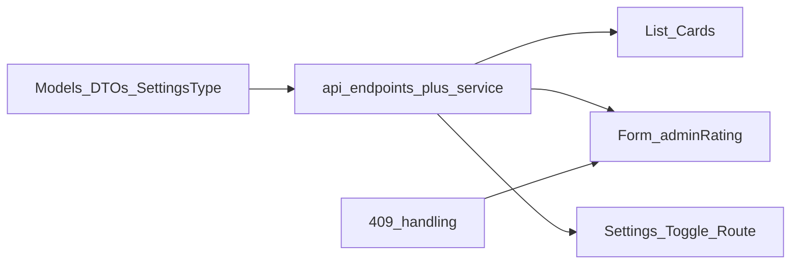

# Plan: Kuratierte Spots – Admin-Bewertung & Nutzer-Bewertungs-Toggle (Admin-FE)

## Ausgangslage (Repo)

- Datenmodell [`src/models/curated-spot.ts`](src/models/curated-spot.ts) enthält **noch keine** Felder `adminRating`, `adminRatedAt`, `userRatingAverage`, `userRatingCount`; DTOs kennen **kein** `adminRating`.
- [`src/lib/api.ts`](src/lib/api.ts) / [`src/services/curatedSpotService.ts`](src/services/curatedSpotService.ts) decken Admin-Liste/Detail/CRUD ab, **nicht** `/curated-spots/settings/user-ratings`.
- UI: [`src/pages/curated-spots/CuratedSpotList.tsx`](src/pages/curated-spots/CuratedSpotList.tsx) und [`src/pages/curated-spots/CuratedSpotForm.tsx`](src/pages/curated-spots/CuratedSpotForm.tsx) – keine Bewertungs-UI.
- [`src/utils/errorUtils.ts`](src/utils/errorUtils.ts): **keine** explizite 409-Behandlung (Doku verlangt klaren Text bei Konflikt).

**Referenzdokumentation (fachlich/API):** [curated-spots-ratings-web-integration.md](file:///Users/dengelma/develop/nuernbergspots/backend/docs/curated-spots-ratings-web-integration.md) – inkl. Regeln „`adminRating` nur einmal schreibbar“, idempotentes erneutes Senden derselben Zahl, `adminRatedAt` nur serverseitig, Toggle-Typ `CuratedSpotsUserRatingsSettings`.

**Projektregeln:** [`.cursorrules`](.cursorrules) – u. a. Rainbow/Glass-Layout, Skeleton statt Spinner für Ladezustände, Loading-Guards gegen parallele Requests, `useEffect`-Dependencies ohne instabile Service-Objekte (wie bereits mit `useRef` in den Curated-Spots-Seiten).

---

## 1. Modelle & Typen

- In [`src/models/curated-spot.ts`](src/models/curated-spot.ts):
  - `CuratedSpot` um optionale/read-only Felder laut Doku ergänzen: `adminRating`, `adminRatedAt`, `userRatingAverage`, `userRatingCount` (sinnvolle Optionalität, falls ältere API-Responses noch ohne Felder kommen).
  - `CreateCuratedSpotDto`: optionales `adminRating?: number` (1–5).
  - `PatchCuratedSpotDto`: optionales `adminRating?: number` (nur sinnvoll, solange noch `null` – UI erzwingt das).
- Neuer Export-Typ z. B. `CuratedSpotsUserRatingsSettings` (gleiche Struktur wie im Doku-Snippet: `id`, `isEnabled`, `updatedAt`, `updatedBy?`).

---

## 2. API-Endpunkte & Service

- In [`src/lib/api.ts`](src/lib/api.ts) Konstante für **`/curated-spots/settings/user-ratings`** (GET/PATCH dieselbe URL).
- In [`src/services/curatedSpotService.ts`](src/services/curatedSpotService.ts):
  - `getUserRatingsSettings(): Promise<CuratedSpotsUserRatingsSettings>`
  - `patchUserRatingsSettings(dto: { isEnabled: boolean }): Promise<CuratedSpotsUserRatingsSettings>`
  - Beides über bestehendes `api.get`/`api.patch` + `unwrapData` wie die anderen Methoden.
- Tests in [`src/services/__tests__/curatedSpotService.test.ts`](src/services/__tests__/curatedSpotService.test.ts) um die beiden Aufrufe erweitern (Mock `get`/`patch`, erwartete Pfade).

---

## 3. Fehlerbehandlung 409 (Redaktionsbewertung)

- Entweder in [`src/utils/errorUtils.ts`](src/utils/errorUtils.ts) **vor** der generischen 4XX-Behandlung einen Zweig für `statusCode === 409` mit verständlichem Titel/Text (wie in der Doku-Vorlage), **oder** in `CuratedSpotForm` beim Speichern der Bewertung gezielt prüfen und `toast`/Text setzen – Ziel: Nutzer sehen explizit, dass die Redaktionsbewertung nach Vergabe **nicht** änderbar ist (nicht nur „Client-Fehler“).

---

## 4. Liste: Anzeige

- [`src/pages/curated-spots/CuratedSpotList.tsx`](src/pages/curated-spots/CuratedSpotList.tsx): In der Karte kurz anzeigen:
  - Redaktion: **read-only Stern-Icons** (z. B. `Star` aus `lucide-react`) – 1–5 gefüllt vs. leer/outline je nach Wert; bei `null` Text „noch nicht vergeben“ und/oder fünf leere Sterne ohne Füllung.
  - Optional: `adminRatedAt` kompakt formatiert (z. B. `Intl.DateTimeFormat` DE).
  - Optional: eine Zeile „Nutzer: Ø … (n Stimmen)“, wenn `userRatingCount` / `userRatingAverage` vorhanden (read-only).
- Textfarben/Layout an bestehende Glass-Karten anpassen (wie andere Spots-Karten).

---

## 5. Formular: Redaktionsbewertung (Create & Edit)

- [`src/pages/curated-spots/CuratedSpotForm.tsx`](src/pages/curated-spots/CuratedSpotForm.tsx):
  - **Auswahl ausschließlich über Stern-Icons:** Fünf Sterne als Steuerung – Klick auf Stern _n_ setzt die Bewertung auf _n_ (1–5); Hover kann alle Sterne bis _n_ visuell hervorheben (übliches Rating-Pattern). Kein Slider/separate Zahleneingabe nötig.
  - Beim Laden (`getAdmin` / nach Create-Redirect): `adminRating`/`adminRatedAt` in State; wenn `adminRating != null`: **nur read-only Sternzeile** (keine `onClick`, `pointer-events-none` o. ä.), kein erneutes Senden eines anderen Werts.
  - **Neuanlage:** Sterne optional wählbar; wenn keine Auswahl, kein `adminRating` im `create`-DTO; sonst gewählter Wert (1–5).
  - **Bearbeiten:** interaktive Sterne nur wenn `adminRating === null`; beim Speichern `patch` mit `{ adminRating }` nur wenn der User eine Erstvergabe auslöst (Loading-Guard `saving` wie bestehend).
  - **Barrierefreiheit:** sinnvolle `aria-label` pro Stern oder ein `radiogroup`-artiges Muster (Screenreader: „Redaktionsbewertung 1 bis 5 Sterne“).
  - Idempotenz: Wenn Nutzer denselben Wert erneut sendet – unkritisch; UI sollte nach erstem Setzen ohnehin sperren.
- Kein `adminRatedAt` ins Request-Body schreiben (Doku).
- Optional kleine wiederverwendbare Hilfskomponente z. B. `AdminRatingStars` in [`src/components/curated-spots/`](src/components/curated-spots/) (oder unter `pages/curated-spots/`), wenn Liste und Formular dasselbe Darstellungs-/Klickverhalten teilen sollen – nur wenn es die Lesbarkeit verbessert, kein Pflicht-Refactor.

---

## 6. Einstellungs-UI: Community-Bewertungen (Toggle)

- Neue Seite z. B. [`src/pages/curated-spots/CuratedSpotsUserRatingsSettings.tsx`](src/pages/curated-spots/CuratedSpotsUserRatingsSettings.tsx) (oder ähnlicher Name):
  - Gleiches Page-Pattern wie andere Admin-Seiten: `Background`, `PageTransition`, Glass-Cards, **Skeleton** während `GET` lädt.
  - `useEffect` mit `[]` für einmaliges Laden der Settings; Service per `useRef` wie in der Liste.
  - **Loading-Guards:** während `PATCH` läuft, Switch/Toggle deaktivieren; kein doppeltes `PATCH` bei schnellem Klicken.
  - [`src/components/ui/switch.tsx`](src/components/ui/switch.tsx) für `isEnabled`; Hinweistext aus Doku (Nutzer dürfen Spots nur **einmal** bewerten, solange Feature an ist).
  - `PATCH` nur für `admin`/`super_admin` (Rolle wie in `CuratedSpotList`/`CuratedSpotForm` laden); für andere Rollen Switch disabled + kurzer Hinweis.
- Route in [`src/routes.tsx`](src/routes.tsx) ergänzen, z. B. `/curated-spots/settings` (oder `/curated-spots/community-ratings`) – **vor** der dynamischen `:id`-Route eintragen, falls Pfad-Kollisionen vermieden werden müssen.
- Link von [`src/pages/curated-spots/CuratedSpotList.tsx`](src/pages/curated-spots/CuratedSpotList.tsx) (Button „Einstellungen Community-Bewertungen“) und ggf. Eintrag in [`src/pages/Dashboard.tsx`](src/pages/Dashboard.tsx) neben dem bestehenden Kuratierte-Spots-Link.

---

## 7. Qualitätssicherung

- `npm test` / gezielt Service-Tests nach Erweiterung.
- Optional: ein kleiner RTL-Test für die Settings-Seite (Toggle + Mock Service), falls ihr die Testabdeckung für neue Pages ausweiten wollt – nicht zwingend, wenn ihr bei Service-Tests bleibt (aktuell keine `CuratedSpot*.test.tsx` im Repo).

---

## Abhängigkeiten / Reihenfolge

