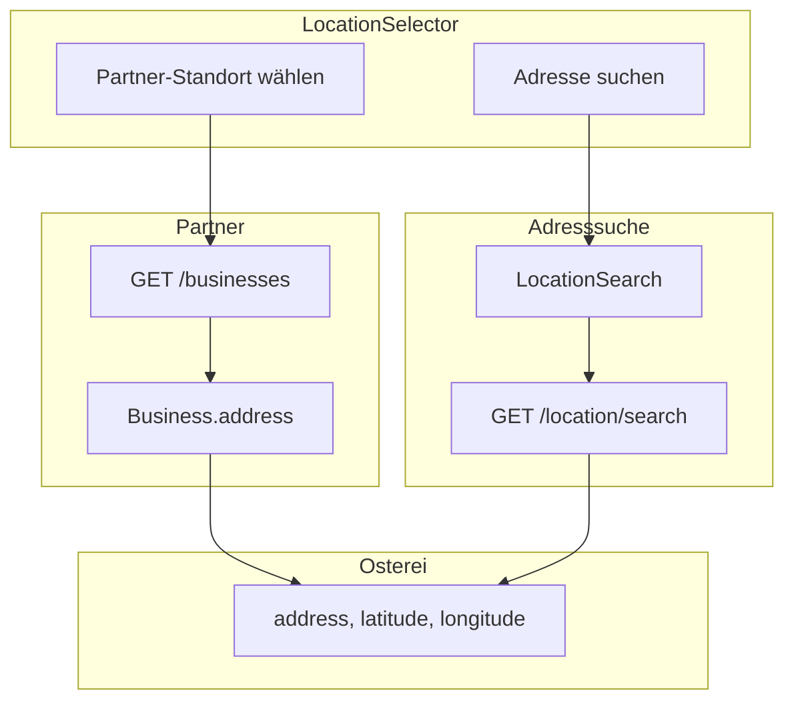

# Osterei-Feature Admin-Frontend Integration

## Kontext

Die Integration folgt der Backend-Dokumentation in [citylife-backend/docs/easter-egg-hunt-admin-integration.md](/Users/dengelma/develop/citylife-backend/docs/easter-egg-hunt-admin-integration.md). Das Feature hat einen zeitlich begrenzten Charakter mit Feature-Flag und Startdatum. Als Referenz dienen der Advent-Kalender (Feature-Flag, CRUD) sowie Event-/Partner-Erstellung (Location-Logik).

---

## 1. Modelle und Service

**Neue Dateien:**

- `src/models/easter-egg.ts` – Interfaces für:
  - `EasterEgg`, `CreateEasterEggDto`, `UpdateEasterEggDto`
  - `EasterEggFeatureStatus` (isFeatureActive, startDate)
  - `EasterEggStatistics`, `ParticipantPerEgg`
- `src/services/easterEggService.ts` – Service analog zu [adventCalendarService.ts](src/services/adventCalendarService.ts):
  - Base URL: `/easter-egg-hunt`
  - `getFeatureStatus()`, `setFeatureStatus()`
  - `getAll(activeOnly?: boolean)` – `GET /eggs?activeOnly=false` für Admin (alle Eier inkl. inaktive)
  - `getById()`, `create()`, `update()`, `delete()`
  - `uploadImage(id, file)`
  - `addWinner()`, `drawWinners()`
  - `getParticipants()`
  - `getStatistics()`

**API-Endpoints in [lib/api.ts](src/lib/api.ts):** Optional `easterEggHunt: '/easter-egg-hunt'` als Konstante.

**Backend-Rollen (aus Controller):**

- `GET eggs`, `GET eggs/:id`: `EasterEggHuntEnabledGuard` – bei deaktiviertem Feature: 503
- POST/PATCH/DELETE eggs, winners, participants, statistics, feature-status: nur `admin`, `super_admin`

---

## 2. Location-Auswahl: Partner oder Adresssuche

Die Location soll wählbar sein aus:

1. **Partner-Standort** – Auswahl aus `/businesses`
2. **Adresssuche** – wie bei Events/Partnern über `LocationSearch` ([LocationSearch.tsx](src/components/ui/LocationSearch.tsx))

**Umsetzung:** neue Komponente `LocationSelector` (oder Erweiterung bestehender Logik) mit:

- Tabs oder Radio: „Partner-Standort“ / „Adresse suchen“
- **Partner:** Select/Combobox mit `businessService.getBusinesses()` – Anzeige: `business.name` + Adresse
- **Adresse:** bestehende `LocationSearch`

**Mapping Partner → Osterei:**

- Business-Adresse: `street`, `houseNumber`, `postalCode`, `city`, `latitude`, `longitude`
- Osterei-Format: `address` (z.B. „{street} {houseNumber}, {postalCode} {city}“), `latitude`, `longitude`

**Mapping LocationSearch → Osterei:**

- `LocationResult.address.label` → `address`
- `LocationResult.position.lat` → `latitude`
- `LocationResult.position.lng` → `longitude`

Vorbild: [CreateEvent.tsx](src/pages/events/CreateEvent.tsx) (Zeilen 146–157, 447–458) und [EditBusiness.tsx](src/pages/businesses/EditBusiness.tsx) (Zeilen 149–174, 409–428).

---

## 3. Seitenstruktur

### 3.1 Ostereiersuche-Übersicht (Management)

**Datei:** `src/pages/easter-egg/EasterEggManagement.tsx`

- **Feature-Einstellungen** (nur Admin/Super-Admin):
  - Switch für `isFeatureActive`
  - Datumspicker für `startDate` (PUT `feature-status`)
- **Statistik-Karten** (GET `statistics`):
  - totalEggs, activeEggs, totalParticipants, totalWinners
  - Tabellenansicht `participantsPerEgg`
- **503-Handling:** Beim Laden der Eierliste (GET eggs) bei 503 klare Fehlermeldung anzeigen und Link zu Feature-Einstellungen (siehe „EasterEggHuntEnabledGuard“ unten)
- **Ostereier-Liste**:
  - Tabelle/Grid mit: Titel, Adresse, Teilnehmer, Gewinner, Zeitraum
  - Aktionen: Bearbeiten, Löschen, Gewinner, Teilnehmer
- **Navigation:** Button zu „Neues Osterei“, Link zu Osterei-Formular

Referenz: [AdventCalendarManagement.tsx](src/pages/advent-calendar/AdventCalendarManagement.tsx).

### 3.2 Osterei erstellen / bearbeiten

**Datei:** `src/pages/easter-egg/EasterEggForm.tsx`

- Formularfelder: title, description, prizeDescription, numberOfWinners, startDate, endDate
- **Location:** `LocationSelector` (Partner oder Adresssuche)
- Bild-Upload (POST `eggs/:id/image`, analog [AdventCalendarForm.tsx](src/pages/advent-calendar/AdventCalendarForm.tsx) + `useValidatedImageUpload`)

### 3.3 Osterei-Detail (optional, für Gewinner/Teilnehmer)

**Datei:** `src/pages/easter-egg/EasterEggDetail.tsx`

- Anzeige aller Osterei-Daten
- Gewinner: manuell hinzufügen (User-ID), zufällig auslosen
- Teilnehmer-Liste (User-IDs; ggf. mit UserService auflösen zu Namen)

---

## 4. Routing und Navigation

**Routes** ([routes.tsx](src/routes.tsx)):

```tsx
<Route path="/easter-egg-hunt" element={<EasterEggManagement />} />
<Route path="/easter-egg-hunt/new" element={<EasterEggForm />} />
<Route path="/easter-egg-hunt/:id/edit" element={<EasterEggForm />} />
<Route path="/easter-egg-hunt/:id" element={<EasterEggDetail />} />
```

**Dashboard** ([Dashboard.tsx](src/pages/Dashboard.tsx)): NavigationCard unter eigener Sektion „Ostereiersuche“ mit Link zu `/easter-egg-hunt`. Sektion nur sichtbar für Admin/Super-Admin (userType-Check wie bei [AdventCalendarManagement](src/pages/advent-calendar/AdventCalendarManagement.tsx)).

**Rollenprüfung (wichtig):** Nur `admin` und `super_admin` dürfen auf die Ostereiersuche-Seiten zugreifen. Umsetzung:

- Route-Wrapper `AdminRoute` oder Check in jeder Seite: `userType === ADMIN || userType === SUPER_ADMIN`, sonst `<Navigate to="/" />`
- Referenz: [AdventCalendarManagement](src/pages/advent-calendar/AdventCalendarManagement.tsx) Zeile 155 (`isAdminOrSuperAdmin`), [FeatureFlagsManagement](src/pages/FeatureFlagsManagement.tsx) (SUPER_ADMIN für Toggle)

---

## 5. UI/UX gemäß .cursorrules

- **Glassmorphism:** `glassCard`, `glassInput`, `glassButton` aus [glassmorphism.ts](src/lib/glassmorphism.ts)
- **Skeleton-Loading:** Skeleton-Komponenten statt Spinner (vgl. AdventCalendarManagement)
- **Mobile-first:** Responsive Breakpoints wie definiert
- **API-Regeln:** Loading-Guards, keine Duplikate, keine Service-Objekte in `useEffect`-Dependencies

---

## 6. Datenfluss Location




---

## 7. Implementierungsreihenfolge

1. Modelle und Service
2. LocationSelector-Komponente
3. EasterEggForm (erstellen + bearbeiten)
4. EasterEggManagement (Liste, Feature-Status, Statistiken)
5. EasterEggDetail (Gewinner, Teilnehmer)
6. Routes und Dashboard-Navigation
7. Tests (Service, LocationSelector, Formular)

---

## EasterEggHuntEnabledGuard (entschieden)

`GET /eggs` und `GET /eggs/:id` liefern 503, wenn das Feature deaktiviert ist. **Vorgehen:** Feature muss aktiv sein; das Frontend behandelt 503 mit einer verständlichen Fehlermeldung (z.B. „Ostereiersuche ist derzeit deaktiviert. Bitte aktivieren Sie das Feature in den Einstellungen.“) und optional einem Link zu den Feature-Einstellungen.

