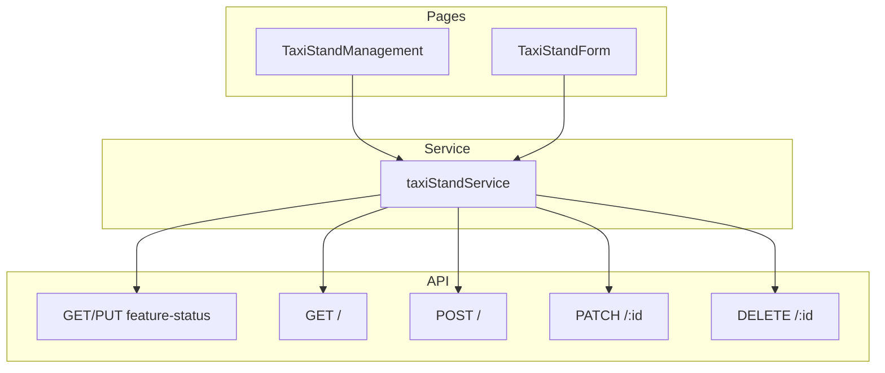

# Taxistandorte Admin Frontend Integration

## Kontext

Integrationsdokumentation: `[citylife-backend/docs/taxi-stands-admin-integration.md](/Users/dengelma/develop/citylife-backend/docs/taxi-stands-admin-integration.md)`

**API Base URL:** `/taxi-stands`
**Bestehende Patterns:** Ostereiersuche (EasterEggManagement), FeatureFlagsManagement, LocationSearch

---

## Architektur

---

## 1. Model und Typen

**Neue Datei:** `[src/models/taxi-stand.ts](src/models/taxi-stand.ts)`

- `TaxiStandLocation`: `{ address, latitude, longitude }`
- `TaxiStand`: `id`, `title?`, `description?`, `numberOfTaxis?`, `phoneNumber`, `location`, `phoneClickTimestamps[]`, `createdAt`, `updatedAt`
- `TaxiStandFeatureStatus`: `{ isFeatureActive, startDate? }`
- `CreateTaxiStandDto`: Pflicht: `address`, `latitude`, `longitude`, `phoneNumber`; optional: `title`, `description`, `numberOfTaxis`
- `UpdateTaxiStandDto`: Alle Felder optional (PATCH)

---

## 2. Service

**Neue Datei:** `[src/services/taxiStandService.ts](src/services/taxiStandService.ts)`

- `useTaxiStandService()` Hook (analog `useEasterEggService`)
- `getFeatureStatus()` → GET `/taxi-stands/feature-status`
- `setFeatureStatus(isFeatureActive, startDate?)` → PUT `/taxi-stands/feature-status`
- `getAll()` → GET `/taxi-stands`
- `create(dto)` → POST `/taxi-stands`
- `update(id, dto)` → PATCH `/taxi-stands/:id`
- `delete(id)` → DELETE `/taxi-stands/:id`

Verwendung von `useApi()`, `unwrapData`, `ApiResponse` wie in `[easterEggService.ts](src/services/easterEggService.ts)`.

---

## 3. Seiten

### 3.1 TaxiStandManagement (Hauptseite)

**Neue Datei:** `[src/pages/taxi-stands/TaxiStandManagement.tsx](src/pages/taxi-stands/TaxiStandManagement.tsx)`

- **Feature-Status** (Admin/Super-Admin): Switch für aktiv/inaktiv, Startdatum (analog EasterEggManagement)
- **Statistik**: Anzahl Telefon-Klicks pro Standort (`phoneClickTimestamps.length`), optional Gesamtzahl
- **Suchfeld**: Suche nach Titel, Adresse, Telefonnummer
- **Liste**: Tabellenansicht (Desktop) und Card-Layout (Mobile) mit:
  - Titel, Adresse, Telefonnummer, Anzahl Taxis, Klick-Anzahl
  - Aktionen: Bearbeiten, Löschen
- **Button:** „Standort anlegen“
- Loading: Skeleton wie bei EasterEggManagement
- Layout: Background, PageTransition, glassmorphism, mobile-first

### 3.2 TaxiStandForm (Anlegen/Bearbeiten)

**Neue Datei:** `[src/pages/taxi-stands/TaxiStandForm.tsx](src/pages/taxi-stands/TaxiStandForm.tsx)`

- **Pflichtfelder:** Adresse, Latitude, Longitude, Telefonnummer
- **Optionale Felder:** Titel, Beschreibung, Anzahl Taxis
- **Adress-Eingabe:** `[LocationSearch](src/components/ui/LocationSearch.tsx)` – liefert `address.label`, `position.lat`, `position.lng`
- Mapping: `LocationResult` → `address` + `latitude` + `longitude`
- Validierung: Pflichtfelder und Telefonformat prüfen
- Submit: Loading-Guard, `disabled` während Request
- Für Bearbeiten: Standort per ID laden, Formular vorbelegen

---

## 4. Routing und Navigation

**Änderungen in `[src/routes.tsx](src/routes.tsx)`:**

- `/taxi-stands` → TaxiStandManagement
- `/taxi-stands/new` → TaxiStandForm (create)
- `/taxi-stands/:id/edit` → TaxiStandForm (edit)

**Änderungen in `[src/pages/Dashboard.tsx](src/pages/Dashboard.tsx)`:**

- Neuer `NavigationCard` in der Sektion „Community“:
  - Titel: z. B. „Taxistandorte“
  - Beschreibung: „Taxistandorte anlegen, bearbeiten und Klick-Statistiken einsehen“
  - Icon: z. B. `MapPin` oder `Car`
  - href: `/taxi-stands`

---

## 5. API-Endpoints (Referenz)

| Methode | Endpoint                    | Beschreibung          |
| ------- | --------------------------- | --------------------- |
| GET     | /taxi-stands/feature-status | Feature-Status laden  |
| PUT     | /taxi-stands/feature-status | Feature-Status setzen |
| GET     | /taxi-stands                | Alle Standorte laden  |
| POST    | /taxi-stands                | Standort anlegen      |
| PATCH   | /taxi-stands/:id            | Standort bearbeiten   |
| DELETE  | /taxi-stands/:id            | Standort löschen      |

---

## 6. Wichtige .cursorrules-Vorgaben

- **API:** Loading-Guards, keine doppelten Requests, `disabled` bei Requests
- **Design:** Glassmorphism, Skeleton statt Spinner, mobile-first
- **Components:** shadcn/ui, Tailwind, AnimatedButton, Background, PageTransition

---

## 7. Testabdeckung (optional, je nach Priorität)

- `TaxiStandManagement.test.tsx`: Grundstruktur, Loading, Feature-Toggle
- `TaxiStandForm.test.tsx`: Validierung, Submit-Verhalten
- `taxiStandService.test.ts`: Service-Methoden (Mock)

---

## Datei-Übersicht

| Aktion | Pfad                                            |
| ------ | ----------------------------------------------- |
| Neu    | `src/models/taxi-stand.ts`                      |
| Neu    | `src/services/taxiStandService.ts`              |
| Neu    | `src/pages/taxi-stands/TaxiStandManagement.tsx` |
| Neu    | `src/pages/taxi-stands/TaxiStandForm.tsx`       |
| Ändern | `src/routes.tsx`                                |
| Ändern | `src/pages/Dashboard.tsx`                       |

